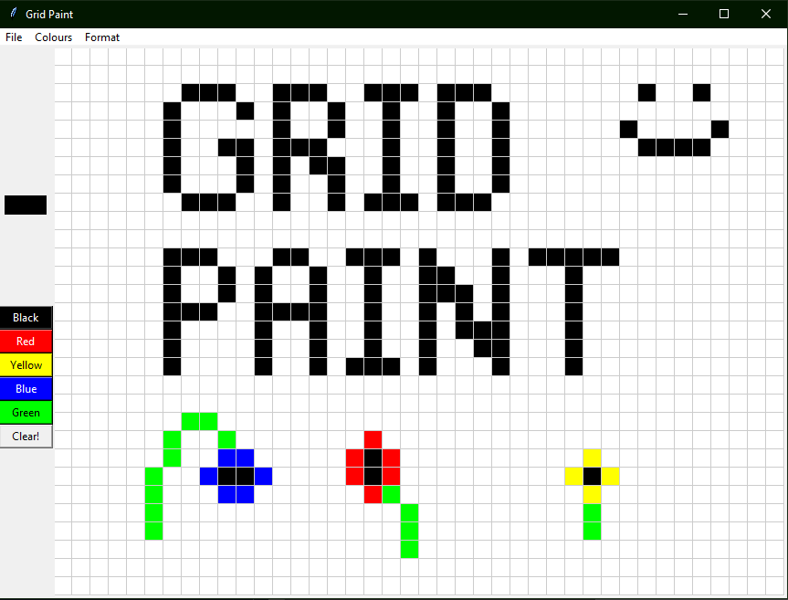
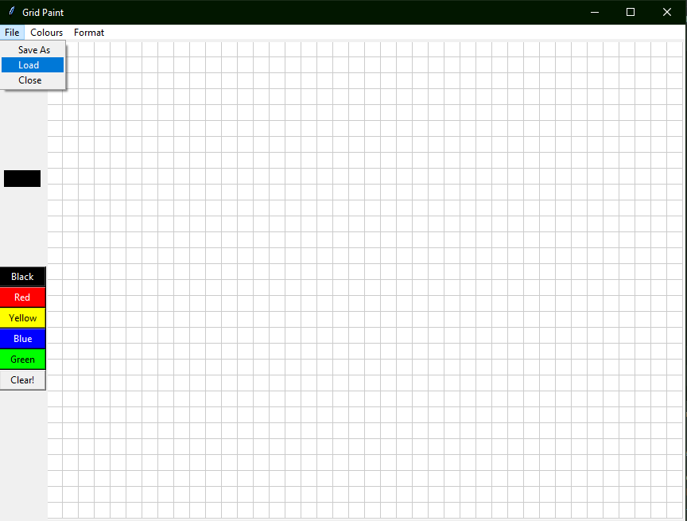

# Grid Paint

A paint like program using a grid of blocks allowing the user to illustrate what they want

### Instructions
- Right click to paint

- Left click to erase

- Use the buttons on the left to change colour

- You can save/load a canvas in the File menu at the top

It's as simple as that 

## Screenshots

